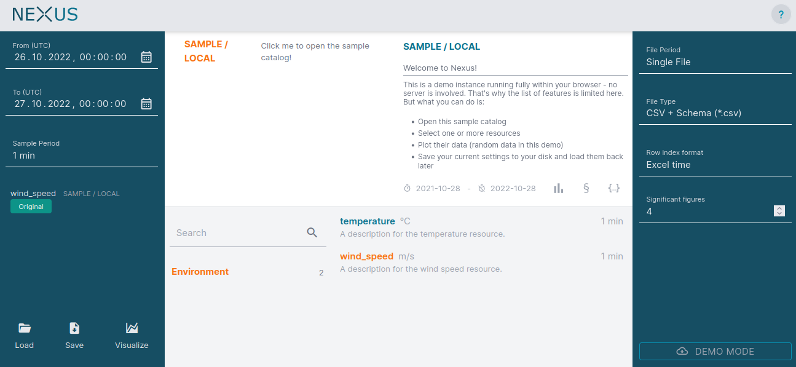

# Nexus

Nexus is an extensible user interface for your time-series data lake with REST API support. It allows the end users access to any kind of equidistant and one-dimensional time-series data. Nexus relies on data sources which are able to read the underlying data format (e.g. a certain file format, databases, other Nexus instances, ...). Please check out the current [ecosystem](notes/ecosystem.md) to see which data sources are available. That document also shows the three distinct ways to create a new data source.

Nexus allows streaming data directly into the GUI or into Python, C# or Matlab clients. Additionally, Nexus supports exporting the data into a specific file format. Supported formats are CSV, HDF5, Matlab (v7.3) and Famos. Like for data sources, it is possible to create and register new data writers.

Please check out the [Live Demo](https://nexus-main.github.io/nexus/) to get a first impression.

> Note: Documentation follows soon. In the meantime, if you are interested in how to setup Nexus and it's data sources, please open a new issue describing your use case.
 

:sparkles: Supported by code contributions from Fraunhofer IWES