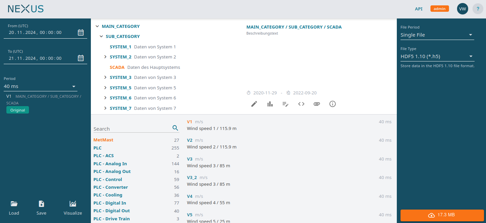
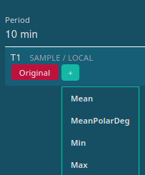
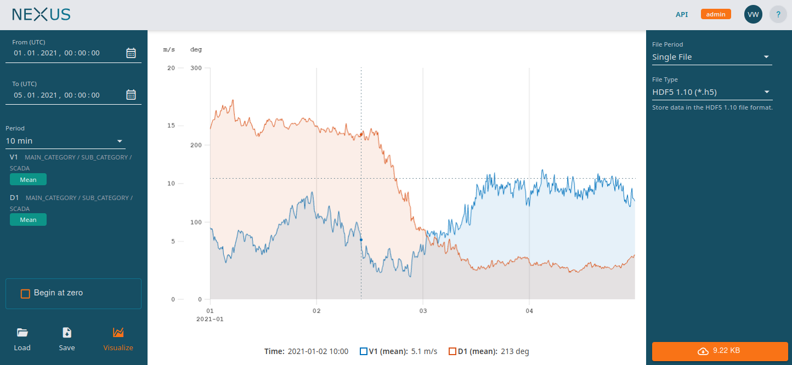
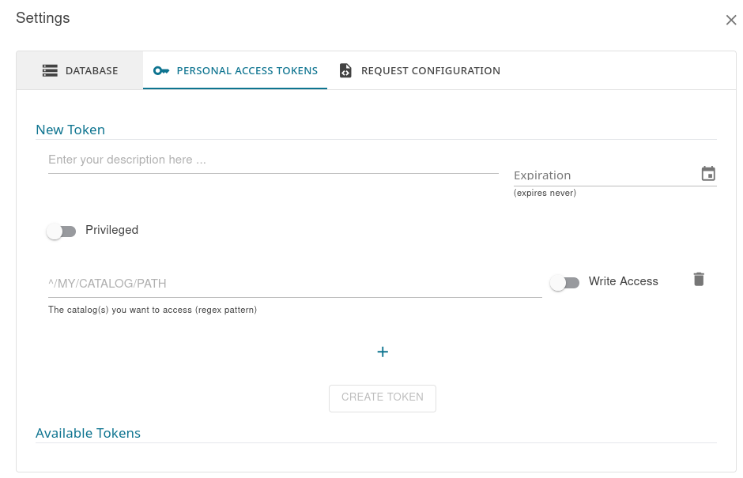

# Nexus

Nexus is an extensible user interface for your time-series data lake with REST API support. It allows the end users access to any kind of equidistant and one-dimensional time-series data. Nexus relies on data sources which are able to read the underlying data format (e.g. a certain file format, databases, other Nexus instances, ...). Please check out the current [ecosystem](notes/ecosystem.md) to see which data sources are available. That document also shows the three distinct ways to create a new data source.

Nexus allows streaming data directly into the GUI or into Python, C# or Matlab clients. Additionally, Nexus supports exporting the data into a specific file format. Supported formats are CSV, HDF5, Matlab (v7.3) and Famos. Like for data sources, it is possible to create and register new data writers.

> [!Note]
> Documentation follows soon. In the meantime, if you are interested in how to setup Nexus and it's data sources, please open a new issue describing your use case.

# Usage

The main elements presented in Nexus are called `catalogs`. These catalogs are often equivalent to a measurement campaign. Within a catalog, there are `resources` (e.g. channels of a data acquisition device) which comprise a unique name, arbitrary properties (metadata) and one or more `representations`. A representation defines the sample period and optional parameters of the associated resource.

Individual catalog items are identified by their resource path. For the resource `T1` of catalog `/SAMPLE/LOCAL` the path identifying the `1 s` representation is equal to `/SAMPLE/LOCAL/T1/1_s`.

In case you need aggregated data, in the UI, simply select a sample period larger than the original sample period. If you already had selected a catalog item and you change the sample period, it will become red. The UI offers you to select an appropriate aggregation method as shown on the right. When you select a sample period of 10 min and the `Mean` aggregation method, the resource path becomes `/SAMPLE/LOCAL/T1/10_min_mean`.

When you copy the path from within the UI, the path is suffixed like this: `/SAMPLE/LOCAL/T1/10_min_mean#base=1_s`. The `base` parameter is only relevant when there are multiple representations per resource so that Nexus knows which representation to use for aggregation.

> [!Note]
> Data will be aggregated on the fly but the results will be cached, so it is much faster the next time you request the same piece of data. A set of preselected data will aggregated on every night to further speed-up the access.

To visualize data, select one or more resources and edit the settings on the left to your needs. When the settings are valid, the button Visualize will be available. Click on that button to load and plot the requested data.

If you prefer to export the data as `.csv` files or to other formats, please adjust the settings on the right to your liking. If the settings are valid the button on the lower right will be enabled. A click on that button starts the export process. The progress will be indicated by a circle which fills itself from 0% to 100%. When the export was successful, you will be able to click on that button to download the data. You can run multiple exports at the same time.

# Personal Access Tokens

Both clients - Python and Matlab - require that you create a token which authenticates your script against Nexus.

You get this token in the Nexus UI's user menu as shown below. Once you have the token, you need to copy it into the scripts shown below (replace the `<token>` placeholder).

Tokens cannot access any catalogs by default (except public catalogs). Enter the catalog path the token needs access to as shown in the screenshot. This value is a regex pattern so you can cover more complex scenarios as well.

# Python

## Load

The following Jupyter Notebooks show how to load the data directly into Python’s memory:

[Synchronous version](https://github.com/nexus-main/nexus/blob/dev/samples/python/sample_load.ipynb)

[Asynchronous version](https://github.com/nexus-main/nexus/blob/dev/samples/python/sample_load_async.ipynb)

## Export

The following Jupyter Notebooks export the data into a `.csv` file, downloads it as `.zip` file including the license (if available) and extracts the data to your local disk:

[Synchronous version](https://github.com/nexus-main/nexus/blob/dev/samples/python/sample_export.ipynb)

[Asynchronous version](https://github.com/nexus-main/nexus/blob/dev/samples/python/sample_export_async.ipynb)

# Matlab

- [This script](https://github.com/nexus-main/nexus/blob/dev/samples/matlab/sample_load.m) loads the data directly into Matlab’s memory

- [This script](https://github.com/nexus-main/nexus/blob/dev/samples/matlab/sample_export.m) exports the data into a `.csv` file, downloads it as `.zip` file including the license (if available) and extracts the data to your local disk

___________

:sparkles: Supported by code contributions from Fraunhofer IWES