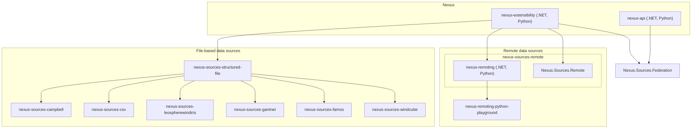

# Extension Types Overview

| Extension Type                | Complexity | Performance | Hosting type                                                   | Dependencies               | Catalog Paths                  | Example                                                                       |
|-------------------------------|------------|-------------|----------------------------------------------------------------|----------------------------|--------------------------------|-------------------------------------------------------------------------------|
| C#                            | High       | Highest     | GitHub Release .zip file or GitLab Package + Tag (e.g. v1.0.0) | all                        | all (Admin approves)           | [Example](https://github.com/Apollo3zehn/nexus-sources-gantner)                          |
| Python Remote Data Source     | Medium     | High/Medium | GitHub/GitLab repository + Tag (e.g. v1.0.0)                   | all (requirements.txt)     | all (Admin approves)           | [Example](https://github.com/malstroem-labs/nexus-remoting-template-python)              |
| Python Playground Data Source | Low        | High/Medium | Single folder per user (VSCode SSH access)     | only preinstalled packages | /PLAYGROUND/%USERNAME%/CATALOG_X | [Example](https://github.com/Apollo3zehn/nexus-remoting-python-playground) |

# Extension Ecosystem

